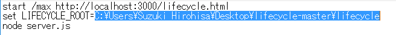
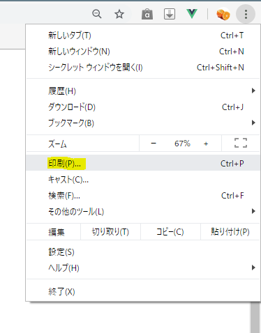
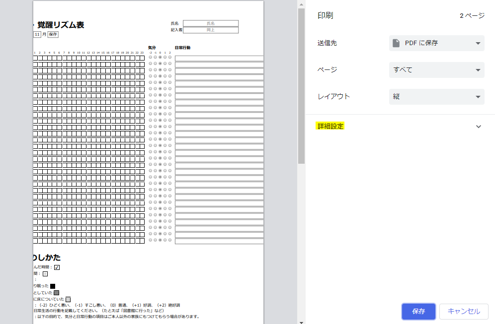
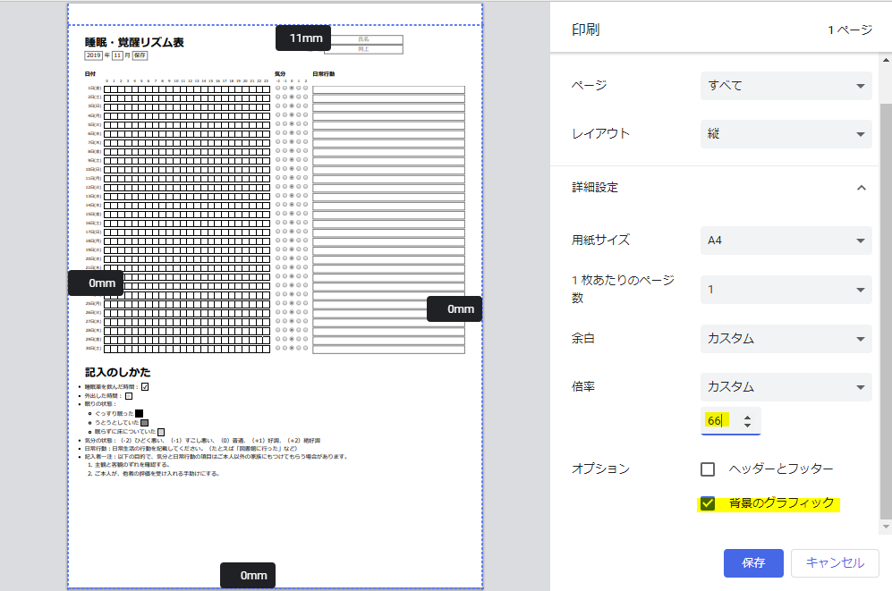

# 「睡眠・覚醒リズム表」Webフォーム

## 起動

* ダウンロードしたlifecycle-master.zipを解凍します。
* 解凍したフォルダ中の **licecycle.bat** ファイルを **右クリック > 「編集」** します。
* 2行目を **lifecycle.bat と同じフォルダ名** に書き換えます。

変更例（Windows）：

* ファイルを上書き保存し、 lifecycle.bat を閉じます。
* エクスプローラーから **lifecycle.bat** をダブルクリックし、batファイルを実行します。

## 使い方
* 年、月をクリックし、編集したい年月を選択します。（デフォルトは現在の年月です。）
* 表中のセルを左クリックしていくと、睡眠時間や外出時間の入力ができます。
* 右クリックした欄は空欄になります。
* 入力が終わったら必ず「**保存**」 ボタンを押してください。

## 印刷
Google chromeでの印刷方法を紹介します。

* 右上の「…」から印刷を選択します。

* 「詳細設定」クリックします。

* 「倍率」を調整（**66%**）し、「**背景のグラフィック**」にチェックを入れます。

* PDFとして保存し、保存したPDFを開きなおして印刷してください。